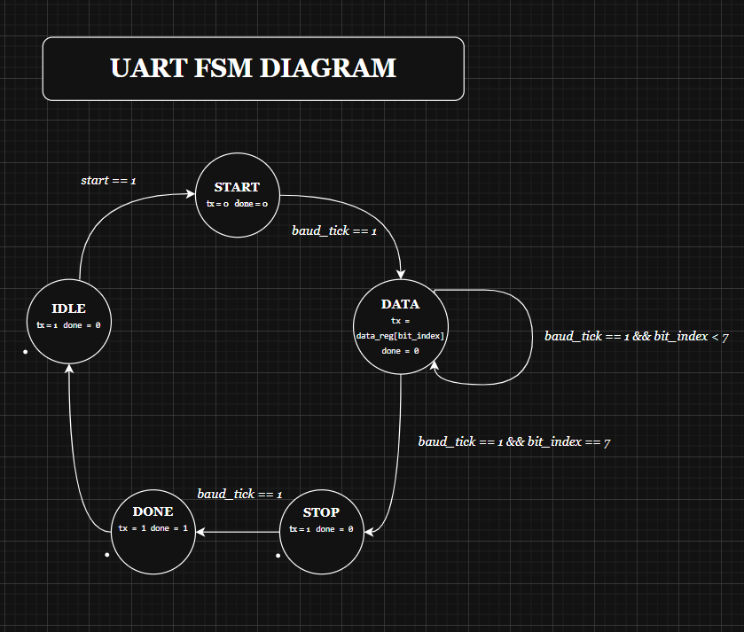

# Multi-Baud Rate UART Transmitter (FSM-Based)

## Description

This repository contains a modular, synthesizeable UART (Universal Asynchronous Receiver-Transmitter) Transmitter written in Verilog HDL. 

The core system uses a Finite State Machine (FSM) to handle sequential serial protocols. By passing system parameters, the architecture calculates internal counters to support variable bandwidths (tested at 9600, 115200, and 1 Mbps). It is mapped to run on standard FPGA boards driven by a 100 MHz onboard crystal oscillator.

---

## Structural UART Data Frame (10-Bit Packet)

A standard UART data packet consists of 10 bits per character:

| Bit Frame | State / Field | TX Line Voltage | Purpose |
| :---: | :--- | :---: | :--- |
| **-** | IDLE | 1'b1 | Default High state when no data is sent |
| **0** | START | 1'b0 | Wake up the receiver (pulled low) |
| **1 - 8** | DATA[0:7] | Variable | 8-Bit Data payload (transmitted LSB first) |
| **9** | STOP | 1'b1 | Returns line to High state to end frame |

---

## Variable Bandwidth and Timing Calculations

Calculations are derived using a standard FPGA System Clock of 100 MHz (Clock Period of 10 ns).

* **Bit Time (tbit):** 1 / Baud Rate
* **Baud Divider Count (BAUD_DIV):** 100,000,000 / Baud Rate
* **Total Transmission Time (Single Character):** tbit x 10 bits

| Tested Baud Rate | Divider Count (BAUD_DIV) | tbit (Time per Bit) | tchar (Time per Char) | Total Time for 6 Chars |
| :--- | :---: | :--- | :--- | :--- |
| **9600 bps** | 10417 | 104.16 microseconds | 1.04 milliseconds | 6.25 milliseconds |
| **115200 bps** | 868 | 8.68 microseconds | 86.8 microseconds | 520.8 microseconds |
| **1 Mbps** | 100 | 1.00 microsecond | 10.0 microseconds | 60.0 microseconds |

---

## Finite State Machine (FSM) Diagram

The transmitter transitions deterministically through 5 hardware states based on the internal baud generator tick:
###  FSM State Diagram

1. **IDLE (3'b000)** - Waiting for the start strobe. TX line is High.
2. **START (3'b001)** - Drives tx = 0 for 1 bit period.
3. **DATA (3'b010)** - Iterates 8 times, shifting serial data out LSB-to-MSB.
4. **STOP (3'b011)** - Drives tx = 1 for 1 bit period.
5. **DONE (3'b100)** - Resets the pulse and jumps back to IDLE.

---

## Simulation 

###  9600 bps Simulation Waveform

###  115200 bps Simulation Waveform

###  1 Mbps Simulation Waveform

###  RTL Schematic

